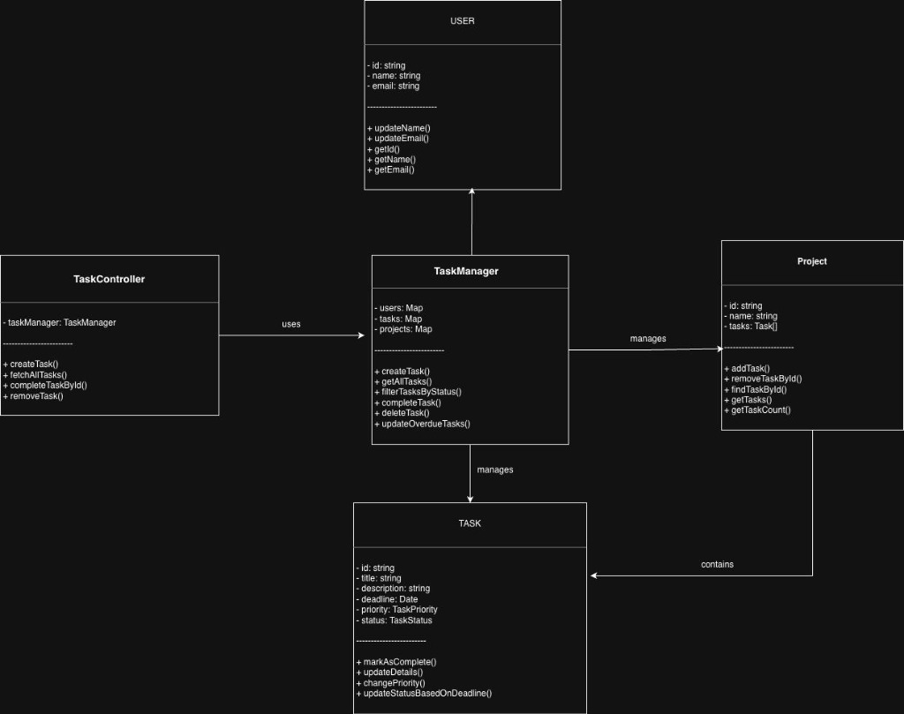
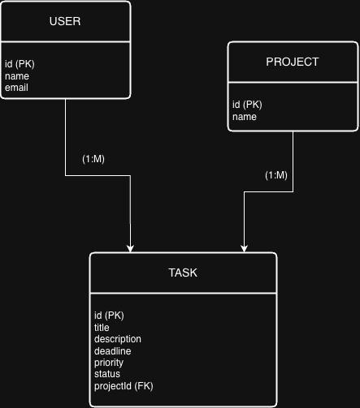

# 📋 Task Management System

A full-stack **Task Management** application built with a strictly encapsulated **Object-Oriented Programming (OOP)** architecture. Designed as part of a Software Design & Software Engineering (SDSE) project to demonstrate core OOP principles in a real-world web application.

---

## ✨ Features

- **Create Tasks** — Add tasks with a title, description, and priority level (Low / Medium / High)
- **View Tasks** — Browse all tasks in a clean, modern interface
- **Filter Tasks** — Filter by status: All, Pending, or Completed
- **Mark Complete** — Mark tasks as completed with a single click
- **Delete Tasks** — Remove tasks that are no longer needed
- **Overdue Detection** — Automatic status update for tasks past their deadline
- **Responsive UI** — Glassmorphism design with animated background, fully responsive layout

---

## 🏗️ OOP Principles Demonstrated

| Principle | Implementation |
|---|---|
| **Encapsulation** | All model fields are `private` with controlled access via getters and dedicated methods |
| **Aggregation** | `Project` class contains a collection of `Task` objects (HAS-A relationship) |
| **Singleton Pattern** | `TaskManager` service uses a single shared instance across the application |
| **Separation of Concerns** | Controller handles HTTP, Service handles business logic, Models hold data |
| **DTO Mapping** | Internal `Task` objects are mapped to plain DTOs before API responses |

---

## 🛠️ Tech Stack

### Backend
- **Runtime:** Node.js
- **Framework:** Express.js v5
- **Language:** TypeScript
- **Architecture:** MVC + Service Layer

### Frontend
- **Framework:** React 18
- **Build Tool:** Vite
- **Language:** TypeScript
- **Styling:** Tailwind CSS v4
- **HTTP Client:** Axios

---

## 📁 Project Structure

```
Task-Management/
├── backend/
│   └── src/
│       ├── server.ts                 # Express server entry point
│       ├── controllers/
│       │   └── TaskController.ts     # Handles HTTP requests & responses
│       ├── services/
│       │   └── TaskManager.ts        # Business logic (Singleton)
│       ├── models/
│       │   ├── Task.ts               # Task entity with encapsulated state
│       │   ├── Project.ts            # Project entity (aggregation of tasks)
│       │   └── User.ts               # User entity
│       └── routes/
│           └── taskRoutes.ts         # REST API route definitions
│
├── frontend/
│   └── src/
│       ├── main.tsx                  # React entry point
│       ├── App.tsx                   # Main application component
│       ├── components/
│       │   ├── TaskForm.tsx          # Task creation form
│       │   ├── TaskList.tsx          # Task listing with actions
│       │   └── ui/
│       │       └── dotted-glow-background.tsx  # Animated canvas background
│       ├── api/
│       │   └── apiClient.ts          # Axios-based API service
│       ├── models/
│       │   └── types.ts              # Shared TypeScript types & enums
│       ├── index.css                 # Global styles & Tailwind config
│       └── App.css                   # App-level styles
│
└── README.md
```

---

## 🚀 Getting Started

### Prerequisites

- [Node.js](https://nodejs.org/) (v18 or higher)
- npm (comes with Node.js)

### Installation & Setup

**1. Clone the repository**

```bash
git clone https://github.com/Chait0001/Task-Management.git
cd Task-Management
```

**2. Install backend dependencies**

```bash
cd backend
npm install
```

**3. Install frontend dependencies**

```bash
cd ../frontend
npm install
```

**4. Start the backend server**

```bash
cd ../backend
npx nodemon --exec ts-node src/server.ts
```

The API will start at `http://localhost:4000`

**5. Start the frontend dev server**

```bash
cd ../frontend
npm run dev
```

The app will open at `http://localhost:3000`

---

## 📡 API Endpoints

| Method | Endpoint | Description |
|--------|----------|-------------|
| `GET` | `/api/tasks` | Fetch all tasks (optional `?status=Pending\|Completed`) |
| `POST` | `/api/tasks` | Create a new task |
| `PATCH` | `/api/tasks/:id/complete` | Mark a task as completed |
| `DELETE` | `/api/tasks/:id` | Delete a task by ID |

### Example — Create a Task

```bash
curl -X POST http://localhost:4000/api/tasks \
  -H "Content-Type: application/json" \
  -d '{"title": "Study for exam", "description": "Revise chapters 1-5", "priority": "High"}'
```

---

## 🧩 Diagrams

### Class Diagram



### ER Diagram



---

## 👥 Contributors

- **Chaitanya Kumar**
- **Aaryan Gera**
- **Archit Gosain**
- **Garv Verma**
- **M. S. Thejas**

---
