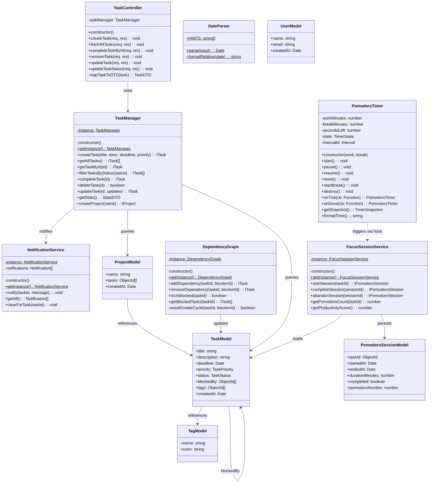

# Class Diagram

```mermaid
classDiagram
    class TaskController {
        -taskManager: TaskManager
        +constructor()
        +createTask(req, res): void
        +fetchAllTasks(req, res): void
        +completeTaskById(req, res): void
        +removeTask(req, res): void
        +updateTask(req, res): void
        +updateTaskStatus(req, res): void
        -mapTaskToDTO(task): TaskDTO
    }

    class TaskManager {
        -instance: TaskManager$
        -constructor()
        +getInstance()$ TaskManager
        +createTask(title, desc, deadline, priority): ITask
        +getAllTasks(): ITask[]
        +getTaskById(id): ITask
        +filterTasksByStatus(status): ITask[]
        +completeTask(id): ITask
        +deleteTask(id): boolean
        +updateTask(id, updates): ITask
        +getStats(): StatsDTO
        +createProject(name): IProject
    }

    class NotificationService {
        -instance: NotificationService$
        -notifications: Notification[]
        -constructor()
        +getInstance()$ NotificationService
        +notify(taskId, message): void
        +getAll(): Notification[]
        +clearForTask(taskId): void
    }

    class PomodoroTimer {
        -workMinutes: number
        -breakMinutes: number
        -secondsLeft: number
        -state: TimerState
        -intervalId: Interval
        +constructor(work, break)
        +start(): void
        +pause(): void
        +resume(): void
        +reset(): void
        +startBreak(): void
        +destroy(): void
        +onTick(cb: Function): PomodoroTimer
        +onDone(cb: Function): PomodoroTimer
        +getSnapshot(): TimerSnapshot
        +formatTime(): string
    }

    class DateParser {
        +HINTS: string[]$
        +parse(input): Date$
        +formatRelative(date): string$
    }

    class FocusSessionService {
        -instance: FocusSessionService$
        -constructor()
        +getInstance()$ FocusSessionService
        +startSession(taskId): IPomodoroSession
        +completeSession(sessionId): IPomodoroSession
        +abandonSession(sessionId): IPomodoroSession
        +getPomodoroCount(taskId): number
        +getProductivityScore(): number
    }

    class DependencyGraph {
        -instance: DependencyGraph$
        -constructor()
        +getInstance()$ DependencyGraph
        +addDependency(taskId, blockerId): ITask
        +removeDependency(taskId, blockerId): ITask
        +isUnblocked(taskId): boolean
        +getBlockedTasks(taskId): ITask[]
        -wouldCreateCycle(taskId, blockerId): boolean
    }

    class ProjectModel {
        +name: string
        +tasks: ObjectId[]
        +createdAt: Date
    }

    class TaskModel {
        +title: string
        +description: string
        +deadline: Date
        +priority: TaskPriority
        +status: TaskStatus
        +blockedBy: ObjectId[]
        +tags: ObjectId[]
        +createdAt: Date
    }

    class UserModel {
        +name: string
        +email: string
        +createdAt: Date
    }

    class PomodoroSessionModel {
        +taskId: ObjectId
        +startedAt: Date
        +endedAt: Date
        +durationMinutes: number
        +completed: boolean
        +pomodoroNumber: number
    }

    class TagModel {
        +name: string
        +color: string
    }

    TaskController --> TaskManager : uses
    TaskManager --> NotificationService : notifies
    TaskManager --> ProjectModel : queries
    TaskManager --> TaskModel : queries
    FocusSessionService --> TaskModel : reads
    DependencyGraph --> TaskModel : updates
    FocusSessionService --> PomodoroSessionModel : persists
    PomodoroTimer ..> FocusSessionService : triggers via hook
    ProjectModel --> TaskModel : references
    TaskModel --> TagModel : references
    TaskModel --> TaskModel : blockedBy
```
