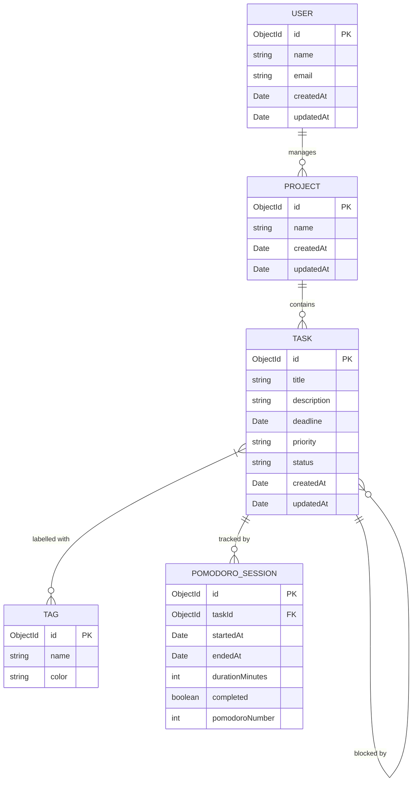

# Entity Relationship Diagram

```mermaid
erDiagram
    USER {
        ObjectId id PK
        string name
        string email
        Date createdAt
        Date updatedAt
    }
    PROJECT {
        ObjectId id PK
        string name
        Date createdAt
        Date updatedAt
    }
    TASK {
        ObjectId id PK
        string title
        string description
        Date deadline
        string priority
        string status
        Date createdAt
        Date updatedAt
    }
    TAG {
        ObjectId id PK
        string name
        string color
    }
    POMODORO_SESSION {
        ObjectId id PK
        ObjectId taskId FK
        Date startedAt
        Date endedAt
        int durationMinutes
        boolean completed
        int pomodoroNumber
    }

    USER ||--o{ PROJECT : manages
    PROJECT ||--o{ TASK : contains
    TASK }|--o{ TAG : "labelled with"
    TASK ||--o{ POMODORO_SESSION : "tracked by"
    TASK ||--o{ TASK : "blocked by"
```
