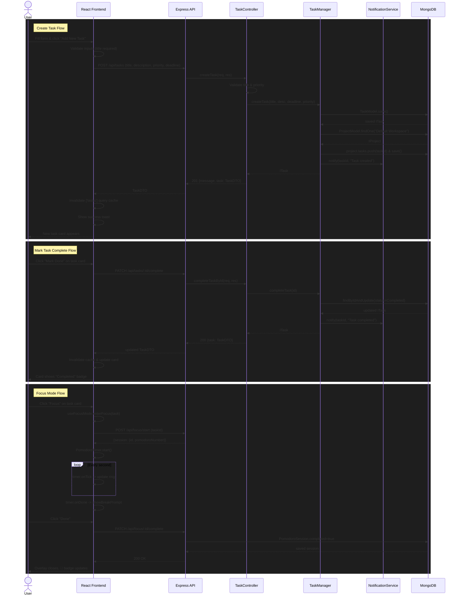

# Sequence Diagram

```mermaid
sequenceDiagram
    actor User
    participant React Frontend
    participant Express API
    participant TaskController
    participant TaskManager
    participant NotificationService
    participant MongoDB

    rect rgb(30, 30, 30)
    note right of User: Create Task Flow
    User->>React Frontend: Fill form & click "Add New Task"
    React Frontend->>React Frontend: Validate inputs (title required)
    React Frontend->>Express API: POST /api/tasks (title, description, priority, deadline)
    Express API->>TaskController: createTask(req, res)
    TaskController->>TaskController: Validate title & priority
    TaskController->>TaskManager: createTask(title, desc, deadline, priority)
    TaskManager->>MongoDB: TaskModel.save()
    MongoDB-->>TaskManager: saved ITask
    TaskManager->>MongoDB: ProjectModel.findOne("Default Workspace")
    MongoDB-->>TaskManager: IProject
    TaskManager->>MongoDB: project.tasks.push(taskId) & save()
    TaskManager->>NotificationService: notify(taskId, "Task created")
    TaskManager-->>TaskController: ITask
    TaskController-->>Express API: 201 {message, task: TaskDTO}
    Express API-->>React Frontend: TaskDTO
    React Frontend->>React Frontend: Invalidate ['tasks'] query cache
    React Frontend->>React Frontend: Show success toast
    React Frontend-->>User: New task card appears
    end

    rect rgb(30, 30, 30)
    note right of User: Mark Task Complete Flow
    User->>React Frontend: Click "Mark Done" on task card
    React Frontend->>Express API: PATCH /api/tasks/:id/complete
    Express API->>TaskController: completeTaskById(req, res)
    TaskController->>TaskManager: completeTask(id)
    TaskManager->>MongoDB: findByIdAndUpdate(status=Completed)
    MongoDB-->>TaskManager: updated ITask
    TaskManager->>NotificationService: notify(taskId, "Task completed")
    TaskManager-->>TaskController: ITask
    TaskController-->>Express API: 200 {task: TaskDTO}
    Express API-->>React Frontend: updated TaskDTO
    React Frontend->>React Frontend: Invalidate cache & update card
    React Frontend-->>User: Card shows "Completed" badge
    end

    rect rgb(30, 30, 30)
    note right of User: Focus Mode Flow
    User->>React Frontend: Click "Focus" on task card
    React Frontend->>React Frontend: useFocusMode.enterFocus(task)
    React Frontend->>Express API: POST /api/focus/start (taskId)
    Express API-->>React Frontend: {session: {id, pomodoroNumber}}
    React Frontend->>React Frontend: PomodoroTimer.start()
    loop Every second
        React Frontend->>React Frontend: timer.onTick -> update ring
    end
    React Frontend->>React Frontend: timer.onDone -> showBreakPrompt
    User->>React Frontend: Click "Done"
    React Frontend->>Express API: PATCH /api/focus/:id/complete
    Express API->>MongoDB: PomodoroSession.completed=true
    MongoDB-->>Express API: saved session
    Express API-->>React Frontend: 200 OK
    React Frontend-->>User: Overlay closes, 🍅 badge updates
    end
```
